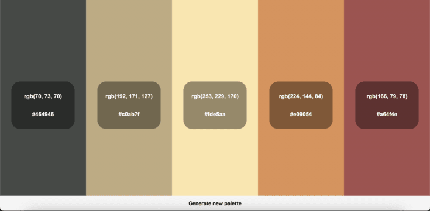

# Internship technical test

This project is made as part of my hiring process as a Fullstack intern at [Racemappr](https://www.racemappr.com/).

## The project consists of 3 parts:

- **Part 1:** Making a vanilla html and javascript page, the page must allow the user to do some action using an API.
- **Part 2:** The app made in part 1 must be made again this time using React, JSX must be used insteal of html/css, additional features may be added.
- **Part 3:** Next.js must be added on the project and hosted on Vercel, Tailwind must be used to style elements, additional features may be added.

**Deliverables**

- A working and accessible Next.js app
- A brief explanation of how the Next.js app works

# Part 1: Vanilla

The first step is defining what application I will make, after stumbling upon many APIs I decided to make an application based on the [colormind](http://colormind.io/api-access/) API which provides palettes of matching colors.

I want the user to be able to generate a palette of colors until he is satisfied, I also want him to be able to copy easily in the clipboard the colors he is interested in. He should also be able to copy the wanted color in hexadecimal or rgb format.

My file structure will be:

- /
  - **index.html** `Holds the front-end code`
  - **server.js** `Holds the server code to host the application`
  - **static/**
    - **script.js** `Holds the color palette generator code`

For this part use `node server.js` to run the application

### **Final result**

Here's a screenshot of the final result:

### **Thoughts**:

- I had some trouble loading static files on the server, at first I did not quite understood at first why it tried to load `script.js` with in the `text/html` as format
- I struggled a bit in converting rgb to hexadecimal format, for this precise function I assisted myself with [StackOverflow](https://stackoverflow.com/questions/5623838/rgb-to-hex-and-hex-to-rgb)
- I let on purpose a margin of progression in order to add additional features in the next sections
